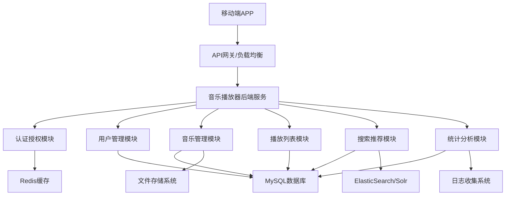
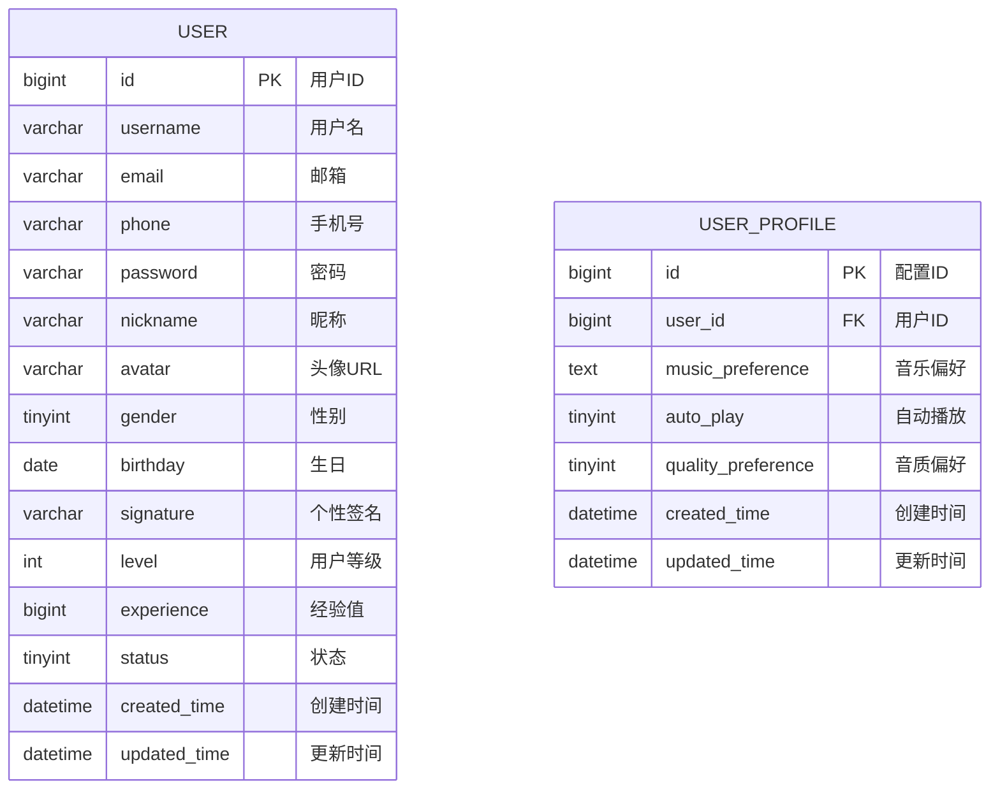
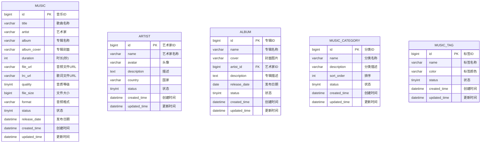
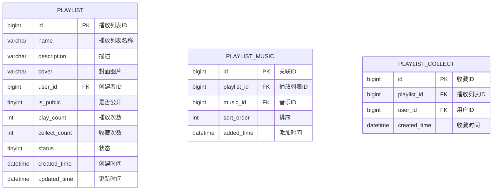
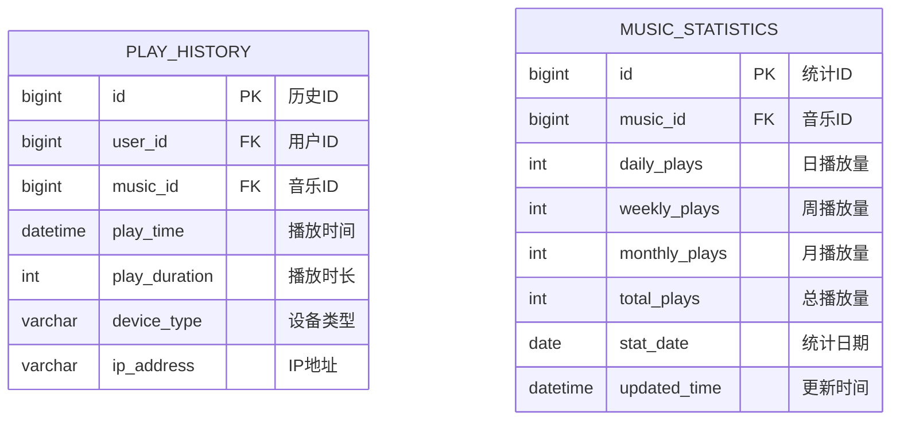
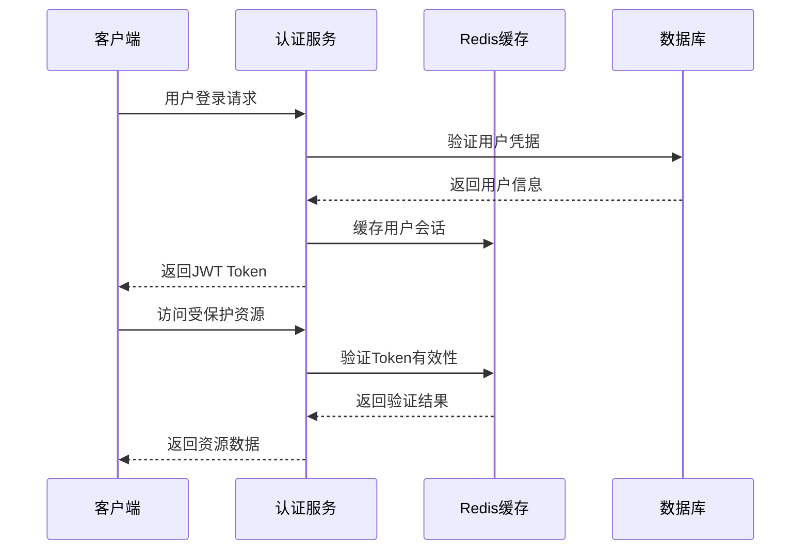
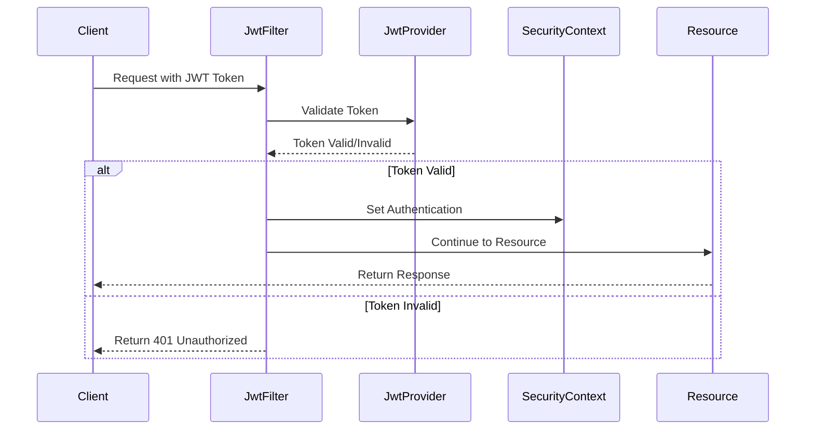
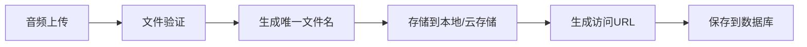
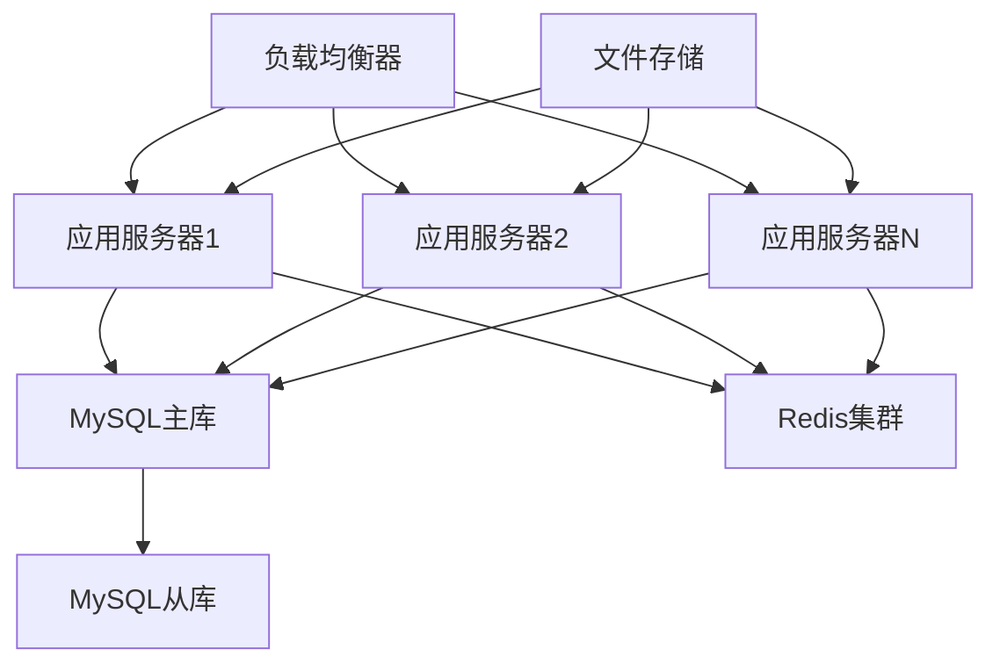

# 音乐播放器后端服务项目规划与开发设计

## 项目概述

本项目旨在开发一个企业级音乐播放器APP的后端服务，参照酷狗音乐、网易云音乐、QQ音乐等成熟音乐平台的功能设计，提供完整的音乐内容管理、用户管理、播放服务等核心功能。

### 技术栈

- **框架**: Spring Boot 3.5.5
- **安全**: Spring Security 6.5.3 + JWT (jjwt 0.12.7)
- **数据库**: MySQL 9.4.0 + MyBatis Plus 3.5.12
- **缓存**: Redis 8.0.x
- **构建工具**: Gradle Kotlin DSL
- **开发语言**: Java 21
- **文档**: Knife4j 4.5.0
- **工具**: Lombok 1.18.38

## 系统架构



## 核心功能模块

### 1. 用户管理模块 (User Management)

#### 功能描述
- 用户注册、登录、注销
- 用户信息管理
- 用户偏好设置
- 用户等级体系

#### 数据模型



### 2. 音乐管理模块 (Music Management)

#### 功能描述
- 音乐上传与存储
- 音乐信息管理
- 音乐分类与标签
- 音乐版权管理

#### 数据模型



### 3. 播放列表模块 (Playlist Management)

#### 功能描述
- 创建、编辑、删除播放列表
- 播放列表音乐管理
- 播放列表分享
- 收藏播放列表

#### 数据模型



### 4. 播放历史与统计模块 (Play History & Analytics)

#### 功能描述
- 用户播放历史记录
- 音乐播放统计
- 用户行为分析
- 热门排行榜

#### 数据模型



## API接口设计

### 1. 用户认证接口



#### 核心接口列表

| 接口路径 | 方法 | 功能描述 |
|---------|------|----------|
| `/api/auth/register` | POST | 用户注册 |
| `/api/auth/login` | POST | 用户登录 |
| `/api/auth/logout` | POST | 用户登出 |
| `/api/auth/refresh` | POST | 刷新Token |
| `/api/auth/verify` | GET | 验证Token有效性 |

### 2. 音乐管理接口

| 接口路径 | 方法 | 功能描述 |
|---------|------|----------|
| `/api/music/search` | GET | 音乐搜索 |
| `/api/music/{id}` | GET | 获取音乐详情 |
| `/api/music/{id}/stream` | GET | 音乐流播放 |
| `/api/music/{id}/lyrics` | GET | 获取歌词 |
| `/api/music/hot` | GET | 热门音乐 |
| `/api/music/recommend` | GET | 推荐音乐 |

### 3. 播放列表接口

| 接口路径 | 方法 | 功能描述 |
|---------|------|----------|
| `/api/playlist` | GET | 获取播放列表 |
| `/api/playlist` | POST | 创建播放列表 |
| `/api/playlist/{id}` | PUT | 更新播放列表 |
| `/api/playlist/{id}` | DELETE | 删除播放列表 |
| `/api/playlist/{id}/music` | POST | 添加音乐到播放列表 |
| `/api/playlist/{id}/music/{musicId}` | DELETE | 从播放列表移除音乐 |

## 数据库设计

### MySQL数据库表结构

```sql
-- 用户表
CREATE TABLE `users` (
  `id` bigint NOT NULL AUTO_INCREMENT COMMENT '用户ID',
  `username` varchar(50) NOT NULL UNIQUE COMMENT '用户名',
  `email` varchar(100) NOT NULL UNIQUE COMMENT '邮箱',
  `phone` varchar(20) UNIQUE COMMENT '手机号',
  `password` varchar(255) NOT NULL COMMENT '密码',
  `nickname` varchar(100) COMMENT '昵称',
  `avatar` varchar(500) COMMENT '头像URL',
  `gender` tinyint DEFAULT 0 COMMENT '性别:0-未知,1-男,2-女',
  `birthday` date COMMENT '生日',
  `signature` varchar(500) COMMENT '个性签名',
  `level` int DEFAULT 1 COMMENT '用户等级',
  `experience` bigint DEFAULT 0 COMMENT '经验值',
  `status` tinyint DEFAULT 1 COMMENT '状态:0-禁用,1-正常',
  `created_time` timestamp DEFAULT CURRENT_TIMESTAMP COMMENT '创建时间',
  `updated_time` timestamp DEFAULT CURRENT_TIMESTAMP ON UPDATE CURRENT_TIMESTAMP COMMENT '更新时间',
  PRIMARY KEY (`id`),
  KEY `idx_username` (`username`),
  KEY `idx_email` (`email`),
  KEY `idx_phone` (`phone`)
) ENGINE=InnoDB DEFAULT CHARSET=utf8mb4 COMMENT='用户表';

-- 艺术家表
CREATE TABLE `artists` (
  `id` bigint NOT NULL AUTO_INCREMENT COMMENT '艺术家ID',
  `name` varchar(100) NOT NULL COMMENT '艺术家名称',
  `avatar` varchar(500) COMMENT '头像',
  `description` text COMMENT '描述',
  `country` varchar(50) COMMENT '国家',
  `status` tinyint DEFAULT 1 COMMENT '状态:0-禁用,1-正常',
  `created_time` timestamp DEFAULT CURRENT_TIMESTAMP COMMENT '创建时间',
  `updated_time` timestamp DEFAULT CURRENT_TIMESTAMP ON UPDATE CURRENT_TIMESTAMP COMMENT '更新时间',
  PRIMARY KEY (`id`),
  KEY `idx_name` (`name`)
) ENGINE=InnoDB DEFAULT CHARSET=utf8mb4 COMMENT='艺术家表';

-- 专辑表
CREATE TABLE `albums` (
  `id` bigint NOT NULL AUTO_INCREMENT COMMENT '专辑ID',
  `name` varchar(200) NOT NULL COMMENT '专辑名称',
  `cover` varchar(500) COMMENT '封面图片',
  `artist_id` bigint NOT NULL COMMENT '艺术家ID',
  `description` text COMMENT '专辑描述',
  `release_date` date COMMENT '发布日期',
  `status` tinyint DEFAULT 1 COMMENT '状态:0-禁用,1-正常',
  `created_time` timestamp DEFAULT CURRENT_TIMESTAMP COMMENT '创建时间',
  `updated_time` timestamp DEFAULT CURRENT_TIMESTAMP ON UPDATE CURRENT_TIMESTAMP COMMENT '更新时间',
  PRIMARY KEY (`id`),
  KEY `idx_artist_id` (`artist_id`),
  KEY `idx_name` (`name`)
) ENGINE=InnoDB DEFAULT CHARSET=utf8mb4 COMMENT='专辑表';

-- 音乐表
CREATE TABLE `music` (
  `id` bigint NOT NULL AUTO_INCREMENT COMMENT '音乐ID',
  `title` varchar(200) NOT NULL COMMENT '歌曲名称',
  `artist_id` bigint NOT NULL COMMENT '艺术家ID',
  `album_id` bigint COMMENT '专辑ID',
  `album_cover` varchar(500) COMMENT '专辑封面',
  `duration` int NOT NULL COMMENT '时长(秒)',
  `file_url` varchar(500) NOT NULL COMMENT '音频文件URL',
  `lrc_url` varchar(500) COMMENT '歌词文件URL',
  `quality` tinyint DEFAULT 1 COMMENT '音质等级:1-标准,2-高品质,3-无损',
  `file_size` bigint COMMENT '文件大小(字节)',
  `format` varchar(10) DEFAULT 'mp3' COMMENT '音频格式',
  `status` tinyint DEFAULT 1 COMMENT '状态:0-禁用,1-正常',
  `release_date` datetime COMMENT '发布日期',
  `created_time` timestamp DEFAULT CURRENT_TIMESTAMP COMMENT '创建时间',
  `updated_time` timestamp DEFAULT CURRENT_TIMESTAMP ON UPDATE CURRENT_TIMESTAMP COMMENT '更新时间',
  PRIMARY KEY (`id`),
  KEY `idx_artist_id` (`artist_id`),
  KEY `idx_album_id` (`album_id`),
  KEY `idx_title` (`title`)
) ENGINE=InnoDB DEFAULT CHARSET=utf8mb4 COMMENT='音乐表';

-- 播放列表表
CREATE TABLE `playlists` (
  `id` bigint NOT NULL AUTO_INCREMENT COMMENT '播放列表ID',
  `name` varchar(200) NOT NULL COMMENT '播放列表名称',
  `description` text COMMENT '描述',
  `cover` varchar(500) COMMENT '封面图片',
  `user_id` bigint NOT NULL COMMENT '创建者ID',
  `is_public` tinyint DEFAULT 1 COMMENT '是否公开:0-私有,1-公开',
  `play_count` int DEFAULT 0 COMMENT '播放次数',
  `collect_count` int DEFAULT 0 COMMENT '收藏次数',
  `status` tinyint DEFAULT 1 COMMENT '状态:0-禁用,1-正常',
  `created_time` timestamp DEFAULT CURRENT_TIMESTAMP COMMENT '创建时间',
  `updated_time` timestamp DEFAULT CURRENT_TIMESTAMP ON UPDATE CURRENT_TIMESTAMP COMMENT '更新时间',
  PRIMARY KEY (`id`),
  KEY `idx_user_id` (`user_id`),
  KEY `idx_name` (`name`)
) ENGINE=InnoDB DEFAULT CHARSET=utf8mb4 COMMENT='播放列表表';
```

## 项目结构

```
music-server/
├── build.gradle.kts                    # Gradle构建脚本
├── settings.gradle.kts                 # Gradle设置
├── src/
│   ├── main/
│   │   ├── java/
│   │   │   └── com/
│   │   │       └── musicserver/
│   │   │           ├── MusicServerApplication.java    # 主启动类
│   │   │           ├── config/                        # 配置类
│   │   │           │   ├── SecurityConfig.java        # Spring Security配置
│   │   │           │   ├── RedisConfig.java          # Redis配置
│   │   │           │   ├── MybatisPlusConfig.java    # MyBatis Plus配置
│   │   │           │   └── SwaggerConfig.java        # Swagger配置
│   │   │           ├── controller/                   # 控制层
│   │   │           │   ├── AuthController.java       # 认证控制器
│   │   │           │   ├── UserController.java       # 用户控制器
│   │   │           │   ├── MusicController.java      # 音乐控制器
│   │   │           │   └── PlaylistController.java   # 播放列表控制器
│   │   │           ├── service/                      # 服务层
│   │   │           │   ├── AuthService.java          # 认证服务
│   │   │           │   ├── UserService.java          # 用户服务
│   │   │           │   ├── MusicService.java         # 音乐服务
│   │   │           │   └── PlaylistService.java      # 播放列表服务
│   │   │           ├── mapper/                       # 数据访问层
│   │   │           │   ├── UserMapper.java           # 用户Mapper
│   │   │           │   ├── MusicMapper.java          # 音乐Mapper
│   │   │           │   └── PlaylistMapper.java       # 播放列表Mapper
│   │   │           ├── entity/                       # 实体类
│   │   │           │   ├── User.java                 # 用户实体
│   │   │           │   ├── Music.java                # 音乐实体
│   │   │           │   └── Playlist.java             # 播放列表实体
│   │   │           ├── dto/                          # 数据传输对象
│   │   │           ├── vo/                           # 视图对象
│   │   │           ├── common/                       # 公共类
│   │   │           │   ├── Result.java               # 统一返回结果
│   │   │           │   ├── BaseEntity.java           # 基础实体类
│   │   │           │   └── Constants.java            # 常量类
│   │   │           ├── security/                     # 安全相关
│   │   │           │   ├── JwtTokenProvider.java     # JWT工具类
│   │   │           │   ├── UserDetailsImpl.java      # 用户详情实现
│   │   │           │   └── JwtAuthenticationFilter.java # JWT过滤器
│   │   │           ├── exception/                    # 异常处理
│   │   │           │   ├── GlobalExceptionHandler.java # 全局异常处理器
│   │   │           │   └── BusinessException.java    # 业务异常类
│   │   │           └── utils/                        # 工具类
│   │   │               ├── RedisUtil.java            # Redis工具类
│   │   │               ├── FileUtil.java             # 文件工具类
│   │   │               └── ValidationUtil.java       # 验证工具类
│   │   └── resources/
│   │       ├── application.yml                       # 主配置文件
│   │       ├── application-dev.yml                   # 开发环境配置
│   │       ├── application-prod.yml                  # 生产环境配置
│   │       └── mapper/                               # MyBatis XML映射文件
│   │           ├── UserMapper.xml
│   │           ├── MusicMapper.xml
│   │           └── PlaylistMapper.xml
│   └── test/                                         # 测试代码
│       └── java/
│           └── com/
│               └── musicserver/
│                   ├── MusicServerApplicationTests.java
│                   ├── controller/                   # 控制器测试
│                   ├── service/                      # 服务测试
│                   └── mapper/                       # Mapper测试
```

## 技术实现要点

### 1. Spring Security + JWT认证流程



### 2. Redis缓存策略

- **用户会话缓存**: `user:session:{userId}` - 24小时过期
- **热门音乐缓存**: `music:hot` - 1小时过期
- **播放列表缓存**: `playlist:{playlistId}` - 30分钟过期
- **搜索结果缓存**: `search:{keyword}` - 15分钟过期

### 3. 文件存储方案



## 测试策略

### 单元测试覆盖

- **Service层测试**: 业务逻辑验证
- **Controller层测试**: API接口测试
- **Mapper层测试**: 数据访问测试
- **Security测试**: 认证授权测试

### 测试工具

- **JUnit 5**: 单元测试框架
- **Mockito**: Mock框架
- **TestContainers**: 集成测试容器
- **Spring Boot Test**: Spring Boot测试支持

## 部署架构

